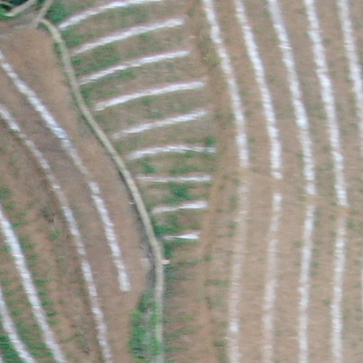
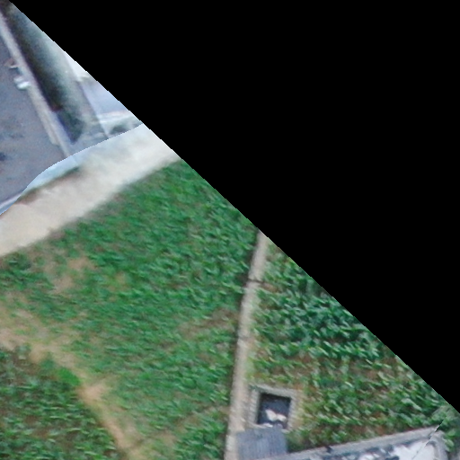

## 比赛网址 
https://tianchi.aliyun.com/competition/entrance/231717/introduction?spm=5176.12281949.1003.4.7e2b2448oGWLby

## 训练数据可视化
visualization.py(需64GB内存)

可视化结果

链接：https://pan.baidu.com/s/1QPQOrYGRGRCK61NDOcpByg 
提取码：ktb1 

## 图片裁剪
crop.py
将训练图片裁剪为512×512大小的图片，并将label保存为512×512×3的np矩阵。

